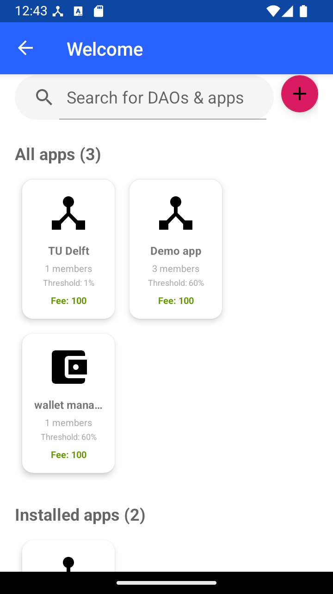
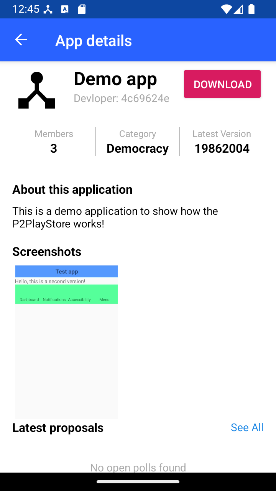
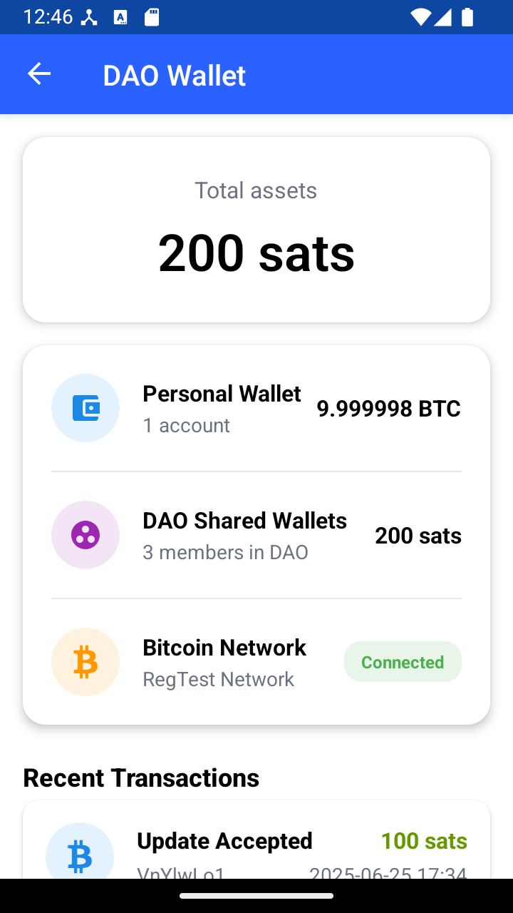
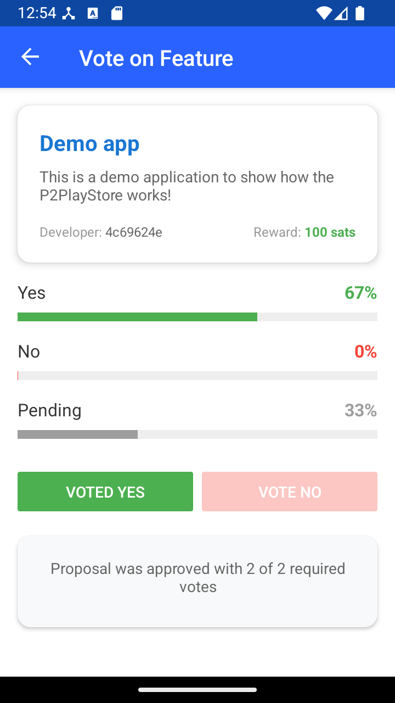
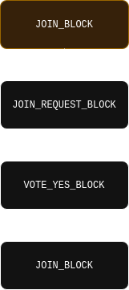
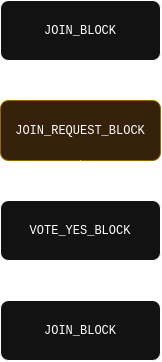
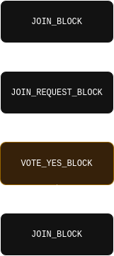
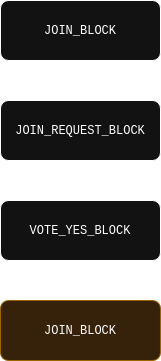

## P2PlayStore
P2Playstore is an Android application built on top of IPv8 and Trustchain, and is integrated into the Trustchain Superapp. It is a proof-of-concept implementation of a DAO system which provides a platform for proposing updates for applications. Each application is a separate DAO through which voting and transactions of bounty for solutions of features are handled. In P2Playstore, Trustchain is used for communication and bookkeeping while the Bitcoin blockchain is used to have collective multi-signature wallets for each DAO. The content of the app is split up in several tabs:

- **First time launch screens**: The user must set up a bitcoin wallet to be able to use the application. During development, we continuously used the reg test server. The user is routed through this process and guided to the main screen of the application.
- **List of DAO's**     On the main screen of the system the user finds a list of current DAO's. They can create a new DAO or select one of the existing ones to find more info.
- **DAO screen**      Per DAO there is a page containing the details of the application/DAO. If the user is not a member, they can join the DAO. If the user is not a member, they can request features and vote on solutions to those requests. They can also open the newest accepted version of the application through this screen.
- **Voting screen**    To vote on whether a user can join a DAO or whether a solution to a feature requests gets approved, the DAO uses a poll with a threshold specified by the DAO owner.

## Project structure
The project is split into multiple modules to achieve maintainable, modular and testable code. The project uses the following packages:
- **Models**: Contains the necessary functionality and constructors for each part of the system flow of an application DAO.
- **TransactionData**: Provides constructors and other functions for all the blocks that are used in the P2Playstore.
- **UI**: Contains the code that provides the functionality of what happens on screen and provides the connection to the backend of the application.
- **Utils**: Contains externally imported helper functions for the application (including DAO Create and Join helpers) and to help debugging the application.

## Source code

## Block types

| Name | Description |
| :--: | :---- |
| `JOIN_BLOCK` | Used as genesis block to create a new App DAO, or to indicate that someone has successfully joined the DAO. |
| `JOIN_REQUEST_BLOCK` | Used by someone not in the App DAO, when they want to join the app DAO, members of the DAO will respond to this block by voting on it with vote blocks. |
| `VOTE_YES_BLOCK` | Used by members to vote "yes"/agree to the proposed transaction | 
| `VOTE_NO_BLOCK` | Used by members to vote "no"/disagree to the proposed transaction | 
| `FEATURE_REQUEST_BLOCK` | Used by members of the DAO to indicate that they would like a certain feature or bug fix, note that others do NOT vote on the contents of this block to indicate how much they want it or something. Other members can instead propose updates to the app in order to claim the bounty for the feature request and other users will vote on that update block. |
| `PROPOSE_UPDATE_BLOCK` | Used to propose an update based on a requested feature, practically this an extension of the `currencyii` `TRANSFER_FUNDS_ASK_BLOCK` because along with an updated magnet link the developer proposes to move the feature bounty to their own wallet. |
| `UPDATE_ACCEPTED_BLOCK` | Resulting block after an update proposal has received enough votes and the transfer has been completed.  |

Practically speaking only the `UPDATE_ACCEPTED_BLOCK` & `JOIN_BLOCK` actually contain the app meta data like name, description, magnet link.

## Example chains

To further illustrate the TrustChain side of things we have

### Creating a DAO and letting a second member join

| Step | Description |
| :--: | :----- |
|  | <h3>Genesis block</h3>
The DAO is created through the creation of a join block without previous a block, conceptually this is the creator joining a previously non-existent DAO as its only member. Practically this involves the creation of a shared Bitcoin wallet (just like for on-chain-democracy) and providing the data for the initial App release in the form of a name, description, and torrent link to an APK file.
 |
|  | <h3>New user wants to join the DAO</h3>
When a new user wants to join the App's DAO they create a `JOIN_REQUEST_BLOCK` to inform the members of the DAO that there is something for them to vote on. Conceptually this block represents the start of a poll/vote, but practically this block actually contains the transaction data for the `JOIN_BLOCK` that the user actually wants to add to the chain.
 |
|  | <h3>DAO members vote on join request</h3>
When the members of a DAO detect the new `JOIN_REQUEST_BLOCK`, they will respond with agreement or disagreement votes based on whether or not they think the new user should be allowed to be become a member of the DAO. Practically voting yes essentially means that the members add a signature to the transaction of moving all the DAO's funds to a new shared wallet which also has the new user's key.
 |
|  | <h3>New user joins DAO</h3>
The user which created the `JOIN_REQUEST_BLOCK` is responsible for watching the TrustChain and determining when enough votes/signatures have been collected, which can then be used to create a new `JOIN_BLOCK`, using the original transaction data proposed in the `JOIN_REQUEST_BLOCK`. Practically this means a new shared wallet is created with all the keys of the previous members and the key of the new user.
 |

### Limitations
There are a few limitations to consider with this project. First of all, general users and developers have the same rights in the application, which can lead to DAO hijacking. In addition, all users are shown by a unique hash in the application. For privacy this is a safe option, but it does not help to create a community of developers, as hashes are more difficult to recognize than chosen nicknames. Lastly, due to the current implementation of the Freedom Of Computing app, which we reused for this application, this app can only import apk files that do not contain xml files and have their UI handled in a different way.

### Future work
Currently there is no fallback for when the reg test setup fails, hence the application crashes when you try to continue or go back during initialization. Freedom of Computing does implement such a fallback, but due to time constraints, we did not manage to include this. Secondly, there could be functionality added to convert an apk file into a magnet link and torrent file direct in the application to add it to a DAO, as currently we need to convert an apk file to a magnet link outside of the application. Furthermore, there are already some DAO icons that the user can choose from, but it could be enhanced to let the user upload a custom app icon themselves.
